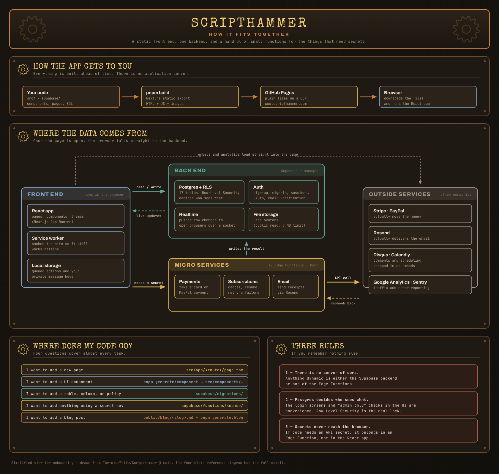

# geoLARP Architecture

System design reference for developers and architects.

---

## Table of Contents

- [Architecture Overview](#architecture-overview)
- [Tech Stack](#tech-stack)
- [Static Export Constraint](#static-export-constraint)
- [Supabase Integration](#supabase-integration)
- [Component Architecture](#component-architecture)
- [Data Flow](#data-flow)
- [Security Model](#security-model)
- [Performance Strategy](#performance-strategy)
- [Testing Architecture](#testing-architecture)
- [Deployment Pipeline](#deployment-pipeline)

---

## Architecture Overview

geoLARP is a **static-first web application** designed for deployment on GitHub Pages with Supabase as the backend-as-a-service.



<sub>The [detailed reference diagram](./architecture-detailed.png) expands this to every table, Edge Function and route. Both are rendered from the committed SVG sources beside them — edit the SVG, not the PNG.</sub>

The ASCII rendering below says the same thing in plain text, for terminals and diffs:

```
┌─────────────────────────────────────────────────────────────────┐
│                        GitHub Pages                              │
│                    (Static File Hosting)                         │
│  ┌───────────────────────────────────────────────────────────┐  │
│  │                    Next.js Static Export                   │  │
│  │  ┌─────────┐  ┌─────────┐  ┌─────────┐  ┌─────────────┐  │  │
│  │  │  Pages  │  │Components│  │  Hooks  │  │   Assets    │  │  │
│  │  └────┬────┘  └────┬────┘  └────┬────┘  └─────────────┘  │  │
│  └───────┼────────────┼───────────┼─────────────────────────┘  │
└──────────┼────────────┼───────────┼─────────────────────────────┘
           │            │           │
           └────────────┼───────────┘
                        │ HTTPS (Client-side only)
                        ▼
┌─────────────────────────────────────────────────────────────────┐
│                         Supabase                                 │
│  ┌──────────┐  ┌──────────┐  ┌──────────┐  ┌──────────────┐    │
│  │   Auth   │  │ Database │  │ Storage  │  │Edge Functions│    │
│  │  (GoTrue)│  │(Postgres)│  │  (S3)    │  │   (Deno)     │    │
│  └──────────┘  └──────────┘  └──────────┘  └──────────────┘    │
│                      │                                          │
│               ┌──────┴──────┐                                   │
│               │     RLS     │                                   │
│               │  Policies   │                                   │
│               └─────────────┘                                   │
└─────────────────────────────────────────────────────────────────┘
```

### Key Principles

| Principle               | Rationale                                       |
| ----------------------- | ----------------------------------------------- |
| Static export           | Free hosting, global CDN, no server maintenance |
| Client-side rendering   | All logic runs in browser                       |
| Supabase backend        | Managed auth, database, storage, functions      |
| RLS security            | Row-level security enforced at database level   |
| Progressive enhancement | Works without JS, enhances with it              |

---

## Tech Stack

### Frontend

| Technology   | Version | Purpose                         |
| ------------ | ------- | ------------------------------- |
| Next.js      | 15+     | React framework with App Router |
| React        | 19+     | UI library                      |
| TypeScript   | 5+      | Type safety (strict mode)       |
| Tailwind CSS | 4       | Utility-first styling           |
| DaisyUI      | 4+      | Component library               |

### Backend (Supabase)

| Service               | Purpose                              |
| --------------------- | ------------------------------------ |
| Auth (GoTrue)         | User authentication, OAuth providers |
| Database (PostgreSQL) | Data storage with RLS                |
| Storage               | File uploads (avatars, attachments)  |
| Realtime              | WebSocket subscriptions              |
| Edge Functions        | Server-side logic requiring secrets  |

### Development

| Tool              | Purpose                         |
| ----------------- | ------------------------------- |
| Docker            | Development environment         |
| pnpm              | Package manager (inside Docker) |
| Vitest            | Unit testing                    |
| Playwright        | E2E testing                     |
| Pa11y             | Accessibility testing           |
| Storybook         | Component documentation         |
| ESLint + Prettier | Code quality                    |
| Husky             | Git hooks                       |

---

## Static Export Constraint

### The Constraint

geoLARP deploys to **GitHub Pages**, which only serves static files. This means:

```
❌ NO server-side rendering (SSR)
❌ NO API routes (src/app/api/)
❌ NO server actions
❌ NO middleware that requires server
❌ NO secrets in client code

✅ Static HTML/CSS/JS only
✅ Client-side data fetching
✅ Supabase for all backend logic
✅ Edge Functions for secrets
```

### What This Means in Practice

**Instead of API routes:**

```typescript
// ❌ WRONG - Won't work in production
// src/app/api/users/route.ts
export async function GET() {
  const users = await db.query('SELECT * FROM users');
  return Response.json(users);
}

// ✅ CORRECT - Client-side with Supabase
// src/lib/users.ts
export async function getUsers() {
  const { data, error } = await supabase.from('users').select('*');
  return data;
}
```

**Instead of server actions:**

```typescript
// ❌ WRONG - Server action won't work
async function createPost(formData: FormData) {
  'use server';
  await db.insert('posts', formData);
}

// ✅ CORRECT - Client-side mutation
async function createPost(formData: FormData) {
  const { error } = await supabase.from('posts').insert({
    title: formData.get('title'),
    content: formData.get('content'),
  });
}
```

**For operations requiring secrets:**

```typescript
// ❌ WRONG - Secret exposed in client
const stripe = new Stripe(process.env.STRIPE_SECRET_KEY);

// ✅ CORRECT - Call Edge Function
const response = await supabase.functions.invoke('create-checkout', {
  body: { priceId: 'price_xxx' },
});
```

### Next.js Configuration

```javascript
// next.config.js
module.exports = {
  output: 'export',
  images: {
    unoptimized: true, // Required for static export
  },
  trailingSlash: true, // Better compatibility with static hosts
};
```

---

## Supabase Integration

### Client Setup

```typescript
// src/lib/supabase/client.ts
import { createBrowserClient } from '@supabase/ssr';

export function createClient() {
  return createBrowserClient(
    process.env.NEXT_PUBLIC_SUPABASE_URL!,
    process.env.NEXT_PUBLIC_SUPABASE_ANON_KEY!
  );
}
```

### Environment Variables

Only `NEXT_PUBLIC_*` variables are available in the client:

```bash
# .env.local (client-accessible)
NEXT_PUBLIC_SUPABASE_URL=https://xxx.supabase.co
NEXT_PUBLIC_SUPABASE_ANON_KEY=eyJ...

# Secrets stored in Supabase Vault (never in client)
# - STRIPE_SECRET_KEY
# - SENDGRID_API_KEY
# - etc.
```

### Database Patterns

**Monolithic Migrations**

Use a single migration file with idempotent statements:

```sql
-- supabase/migrations/001_initial.sql

-- Tables (IF NOT EXISTS for idempotency)
CREATE TABLE IF NOT EXISTS profiles (
  id UUID PRIMARY KEY REFERENCES auth.users(id),
  username TEXT UNIQUE,
  avatar_url TEXT,
  created_at TIMESTAMPTZ DEFAULT NOW()
);

-- RLS Policies
ALTER TABLE profiles ENABLE ROW LEVEL SECURITY;

CREATE POLICY IF NOT EXISTS "Users can view all profiles"
  ON profiles FOR SELECT
  USING (true);

CREATE POLICY IF NOT EXISTS "Users can update own profile"
  ON profiles FOR UPDATE
  USING (auth.uid() = id);
```

**Row-Level Security (RLS)**

All tables MUST have RLS enabled:

```sql
-- Example: Messages table with RLS
CREATE TABLE messages (
  id UUID PRIMARY KEY DEFAULT gen_random_uuid(),
  sender_id UUID REFERENCES auth.users(id),
  recipient_id UUID REFERENCES auth.users(id),
  content TEXT,
  created_at TIMESTAMPTZ DEFAULT NOW()
);

ALTER TABLE messages ENABLE ROW LEVEL SECURITY;

-- Users can only see messages they sent or received
CREATE POLICY "Users see own messages"
  ON messages FOR SELECT
  USING (
    auth.uid() = sender_id OR
    auth.uid() = recipient_id
  );

-- Users can only send messages as themselves
CREATE POLICY "Users send as self"
  ON messages FOR INSERT
  WITH CHECK (auth.uid() = sender_id);
```

### Edge Functions

For operations requiring secrets:

```typescript
// supabase/functions/create-checkout/index.ts
import { serve } from 'https://deno.land/std@0.168.0/http/server.ts';
import Stripe from 'https://esm.sh/stripe@12.0.0';

serve(async (req) => {
  const stripe = new Stripe(Deno.env.get('STRIPE_SECRET_KEY')!, {
    apiVersion: '2023-10-16',
  });

  const { priceId } = await req.json();

  const session = await stripe.checkout.sessions.create({
    mode: 'subscription',
    line_items: [{ price: priceId, quantity: 1 }],
    success_url: `${req.headers.get('origin')}/success`,
    cancel_url: `${req.headers.get('origin')}/cancel`,
  });

  return new Response(JSON.stringify({ url: session.url }), {
    headers: { 'Content-Type': 'application/json' },
  });
});
```

---

## Component Architecture

### 5-File Pattern

Every component follows this mandatory structure:

```
src/components/Button/
├── index.tsx                     # Public exports
├── Button.tsx                    # Component implementation
├── Button.test.tsx               # Unit tests (Vitest)
├── Button.stories.tsx            # Storybook stories
└── Button.accessibility.test.tsx # A11y tests (Pa11y/axe)
```

### File Responsibilities

**index.tsx** - Clean public API

```typescript
export { Button } from './Button';
export type { ButtonProps } from './Button';
```

**Button.tsx** - Implementation

```typescript
export interface ButtonProps {
  variant?: 'primary' | 'secondary' | 'ghost';
  size?: 'sm' | 'md' | 'lg';
  children: React.ReactNode;
}

export function Button({ variant = 'primary', size = 'md', children }: ButtonProps) {
  return (
    <button className={`btn btn-${variant} btn-${size}`}>
      {children}
    </button>
  );
}
```

**Button.test.tsx** - Unit tests

```typescript
import { describe, it, expect } from 'vitest';
import { render, screen } from '@testing-library/react';
import { Button } from './Button';

describe('Button', () => {
  it('renders children', () => {
    render(<Button>Click me</Button>);
    expect(screen.getByRole('button')).toHaveTextContent('Click me');
  });
});
```

**Button.stories.tsx** - Visual documentation

```typescript
import type { Meta, StoryObj } from '@storybook/react';
import { Button } from './Button';

const meta: Meta<typeof Button> = {
  component: Button,
  title: 'Components/Button',
};

export default meta;

export const Primary: StoryObj<typeof Button> = {
  args: { children: 'Primary Button', variant: 'primary' },
};
```

**Button.accessibility.test.tsx** - A11y validation

```typescript
import { describe, it, expect } from 'vitest';
import { axe, toHaveNoViolations } from 'jest-axe';
import { render } from '@testing-library/react';
import { Button } from './Button';

expect.extend(toHaveNoViolations);

describe('Button Accessibility', () => {
  it('has no violations', async () => {
    const { container } = render(<Button>Accessible</Button>);
    expect(await axe(container)).toHaveNoViolations();
  });
});
```

### Directory Structure

```
src/
├── app/                          # Next.js App Router
│   ├── (auth)/                   # Auth route group
│   │   ├── login/
│   │   └── register/
│   ├── (dashboard)/              # Protected routes
│   │   ├── messages/
│   │   └── settings/
│   ├── layout.tsx
│   └── page.tsx
│
├── components/                   # Shared components
│   ├── ui/                       # Primitives (Button, Input, etc.)
│   ├── forms/                    # Form components
│   ├── layout/                   # Layout components (Header, Footer)
│   └── features/                 # Feature-specific components
│
├── hooks/                        # Custom React hooks
│   ├── useAuth.ts
│   ├── useMessages.ts
│   └── useSupabase.ts
│
├── lib/                          # Utilities and services
│   ├── supabase/                 # Supabase client
│   ├── utils/                    # Helper functions
│   └── constants/                # App constants
│
└── types/                        # TypeScript definitions
    ├── database.ts               # Generated from Supabase
    └── api.ts                    # API response types
```

---

## Data Flow

### Authentication Flow

```
┌──────────┐     ┌──────────┐     ┌──────────┐     ┌──────────┐
│  User    │────▶│  Login   │────▶│ Supabase │────▶│ Session  │
│  Action  │     │   Page   │     │   Auth   │     │  Cookie  │
└──────────┘     └──────────┘     └──────────┘     └──────────┘
                                        │
                      ┌─────────────────┼─────────────────┐
                      ▼                 ▼                 ▼
                 ┌─────────┐      ┌─────────┐      ┌─────────┐
                 │ OAuth   │      │  Email  │      │  Magic  │
                 │Provider │      │Password │      │  Link   │
                 └─────────┘      └─────────┘      └─────────┘
```

### Data Fetching Pattern

```typescript
// src/hooks/useMessages.ts
import { useEffect, useState } from 'react';
import { createClient } from '@/lib/supabase/client';

export function useMessages(conversationId: string) {
  const [messages, setMessages] = useState([]);
  const [loading, setLoading] = useState(true);
  const supabase = createClient();

  useEffect(() => {
    // Initial fetch
    async function fetchMessages() {
      const { data } = await supabase
        .from('messages')
        .select('*')
        .eq('conversation_id', conversationId)
        .order('created_at', { ascending: true });

      setMessages(data ?? []);
      setLoading(false);
    }

    fetchMessages();

    // Realtime subscription
    const channel = supabase
      .channel(`messages:${conversationId}`)
      .on(
        'postgres_changes',
        {
          event: 'INSERT',
          schema: 'public',
          table: 'messages',
          filter: `conversation_id=eq.${conversationId}`,
        },
        (payload) => {
          setMessages((prev) => [...prev, payload.new]);
        }
      )
      .subscribe();

    return () => {
      supabase.removeChannel(channel);
    };
  }, [conversationId]);

  return { messages, loading };
}
```

### State Management

```
┌─────────────────────────────────────────────────────────────┐
│                     React Component Tree                     │
├─────────────────────────────────────────────────────────────┤
│                                                              │
│  ┌─────────────┐    Server State    ┌─────────────────────┐ │
│  │  Supabase   │◀──────────────────▶│  React Query /      │ │
│  │  Database   │    (cached)        │  SWR / Custom Hooks │ │
│  └─────────────┘                    └─────────────────────┘ │
│                                                              │
│  ┌─────────────┐    Client State    ┌─────────────────────┐ │
│  │    Forms    │◀──────────────────▶│  React Hook Form /  │ │
│  │    UI       │    (local)         │  useState / Zustand │ │
│  └─────────────┘                    └─────────────────────┘ │
│                                                              │
│  ┌─────────────┐    Global State    ┌─────────────────────┐ │
│  │   Theme     │◀──────────────────▶│  React Context      │ │
│  │   Auth      │    (app-wide)      │  (lightweight)      │ │
│  └─────────────┘                    └─────────────────────┘ │
│                                                              │
└─────────────────────────────────────────────────────────────┘
```

---

## Security Model

### Defense Layers

```
┌─────────────────────────────────────────────────────────────┐
│ Layer 1: Client Validation                                   │
│ - Input sanitization                                         │
│ - Form validation                                            │
│ - CANNOT be trusted (client-side bypass possible)            │
└─────────────────────────────────────────────────────────────┘
                              │
                              ▼
┌─────────────────────────────────────────────────────────────┐
│ Layer 2: Supabase Auth                                       │
│ - JWT verification                                           │
│ - Session management                                         │
│ - OAuth provider integration                                 │
└─────────────────────────────────────────────────────────────┘
                              │
                              ▼
┌─────────────────────────────────────────────────────────────┐
│ Layer 3: Row-Level Security (PRIMARY SECURITY LAYER)         │
│ - Database-enforced access control                           │
│ - Cannot be bypassed from client                             │
│ - Every table MUST have RLS enabled                          │
└─────────────────────────────────────────────────────────────┘
                              │
                              ▼
┌─────────────────────────────────────────────────────────────┐
│ Layer 4: Edge Functions                                      │
│ - Server-side validation                                     │
│ - Secret operations (payments, emails)                       │
│ - Rate limiting                                              │
└─────────────────────────────────────────────────────────────┘
```

### RLS Policy Patterns

```sql
-- Pattern 1: User owns resource
CREATE POLICY "Users own profiles"
  ON profiles
  USING (auth.uid() = user_id);

-- Pattern 2: Public read, authenticated write
CREATE POLICY "Public posts readable"
  ON posts FOR SELECT
  USING (published = true);

CREATE POLICY "Authors can write"
  ON posts FOR ALL
  USING (auth.uid() = author_id);

-- Pattern 3: Role-based access
CREATE POLICY "Admins see all"
  ON users FOR SELECT
  USING (
    EXISTS (
      SELECT 1 FROM user_roles
      WHERE user_id = auth.uid()
      AND role = 'admin'
    )
  );

-- Pattern 4: Group membership
CREATE POLICY "Group members see messages"
  ON group_messages FOR SELECT
  USING (
    EXISTS (
      SELECT 1 FROM group_members
      WHERE group_id = group_messages.group_id
      AND user_id = auth.uid()
    )
  );
```

### Security Checklist

| Requirement          | Implementation                |
| -------------------- | ----------------------------- |
| All tables have RLS  | Enforced in migrations        |
| No secrets in client | Use Edge Functions            |
| CSRF protection      | Supabase handles via auth     |
| XSS prevention       | React escapes by default      |
| SQL injection        | Supabase client parameterizes |
| HTTPS only           | GitHub Pages enforces         |

---

## Performance Strategy

### Optimization Targets

| Metric                   | Target  | Tool             |
| ------------------------ | ------- | ---------------- |
| Lighthouse Performance   | 90+     | Chrome DevTools  |
| First Contentful Paint   | < 2s    | Web Vitals       |
| Time to Interactive      | < 3.5s  | Web Vitals       |
| Cumulative Layout Shift  | < 0.1   | Web Vitals       |
| Bundle Size (First Load) | < 150KB | Next.js analyzer |

### Optimization Techniques

**Code Splitting**

```typescript
// Lazy load heavy components
import dynamic from 'next/dynamic';

const HeavyChart = dynamic(() => import('@/components/Chart'), {
  loading: () => <ChartSkeleton />,
  ssr: false, // Client-only for charts
});
```

**Image Optimization**

```typescript
// Use next/image with static export settings
import Image from 'next/image';

<Image
  src="/hero.webp"
  alt="Hero"
  width={1200}
  height={600}
  priority // Above-fold images
  placeholder="blur"
  blurDataURL={blurUrl}
/>
```

**Data Fetching**

```typescript
// Paginate large datasets
const { data } = await supabase
  .from('posts')
  .select('*')
  .range(0, 9) // First 10 items
  .order('created_at', { ascending: false });
```

---

## Testing Architecture

### Test Pyramid

```
                    ┌───────────┐
                    │    E2E    │  Few, slow, high confidence
                    │(Playwright│
                    └─────┬─────┘
                          │
                 ┌────────┴────────┐
                 │   Integration   │  Some, medium speed
                 │   (Component)   │
                 └────────┬────────┘
                          │
        ┌─────────────────┴─────────────────┐
        │              Unit                  │  Many, fast
        │            (Vitest)                │
        └────────────────────────────────────┘
```

### Test Organization

```
tests/
├── unit/                    # Vitest unit tests
│   ├── hooks/
│   ├── utils/
│   └── components/
│
├── integration/             # Component integration
│   └── features/
│
├── e2e/                     # Playwright E2E
│   ├── auth.spec.ts
│   ├── messaging.spec.ts
│   └── payments.spec.ts
│
└── a11y/                    # Accessibility tests
    └── components/
```

### Coverage Requirements

| Type        | Minimum         | Focus                            |
| ----------- | --------------- | -------------------------------- |
| Unit        | 25%             | Utilities, hooks, pure functions |
| Integration | Critical paths  | User workflows                   |
| E2E         | Happy paths     | Core features                    |
| A11y        | 100% components | WCAG AA compliance               |

---

## Deployment Pipeline

### CI/CD Flow

```
┌──────────┐    ┌──────────┐    ┌──────────┐    ┌──────────┐
│  Push    │───▶│   Test   │───▶│  Build   │───▶│  Deploy  │
│  to PR   │    │  Suite   │    │  Static  │    │  Preview │
└──────────┘    └──────────┘    └──────────┘    └──────────┘
                     │
         ┌───────────┼───────────┐
         ▼           ▼           ▼
    ┌─────────┐ ┌─────────┐ ┌─────────┐
    │  Lint   │ │  Unit   │ │  E2E    │
    │  Check  │ │  Tests  │ │  Tests  │
    └─────────┘ └─────────┘ └─────────┘

┌──────────┐    ┌──────────┐    ┌──────────┐
│  Merge   │───▶│  Build   │───▶│  Deploy  │
│ to main  │    │Production│    │  Pages   │
└──────────┘    └──────────┘    └──────────┘
```

### GitHub Actions

```yaml
# .github/workflows/ci.yml
name: CI

on:
  push:
    branches: [main]
  pull_request:
    branches: [main]

jobs:
  test:
    runs-on: ubuntu-latest
    steps:
      - uses: actions/checkout@v4
      - uses: pnpm/action-setup@v2
      - uses: actions/setup-node@v4
        with:
          node-version: 20
          cache: 'pnpm'
      - run: pnpm install
      - run: pnpm run lint
      - run: pnpm run test
      - run: pnpm run build

  deploy:
    needs: test
    if: github.ref == 'refs/heads/main'
    runs-on: ubuntu-latest
    steps:
      - uses: actions/checkout@v4
      - run: pnpm install && pnpm run build
      - uses: peaceiris/actions-gh-pages@v3
        with:
          github_token: ${{ secrets.GITHUB_TOKEN }}
          publish_dir: ./out
```

---

## Decision Log

Key architectural decisions and their rationale:

| Decision  | Choice                | Rationale                                  |
| --------- | --------------------- | ------------------------------------------ |
| Hosting   | GitHub Pages          | Free, reliable, global CDN                 |
| Backend   | Supabase              | Managed PostgreSQL, auth, realtime         |
| Framework | Next.js               | React ecosystem, static export             |
| Styling   | Tailwind + DaisyUI    | Utility-first, accessible components       |
| State     | React Query + Context | Server state caching, minimal client state |
| Testing   | Vitest + Playwright   | Fast unit tests, reliable E2E              |
| Security  | RLS-first             | Database-enforced, cannot bypass           |

---

## Further Reading

| Topic                 | Resource                                                                                       |
| --------------------- | ---------------------------------------------------------------------------------------------- |
| Next.js Static Export | [Next.js Docs](https://nextjs.org/docs/app/building-your-application/deploying/static-exports) |
| Supabase RLS          | [Supabase RLS Guide](https://supabase.com/docs/guides/auth/row-level-security)                 |
| Edge Functions        | [Supabase Functions](https://supabase.com/docs/guides/functions)                               |
| Accessibility         | [WCAG 2.1 Guidelines](https://www.w3.org/WAI/WCAG21/quickref/)                                 |
| Performance           | [Web Vitals](https://web.dev/vitals/)                                                          |
